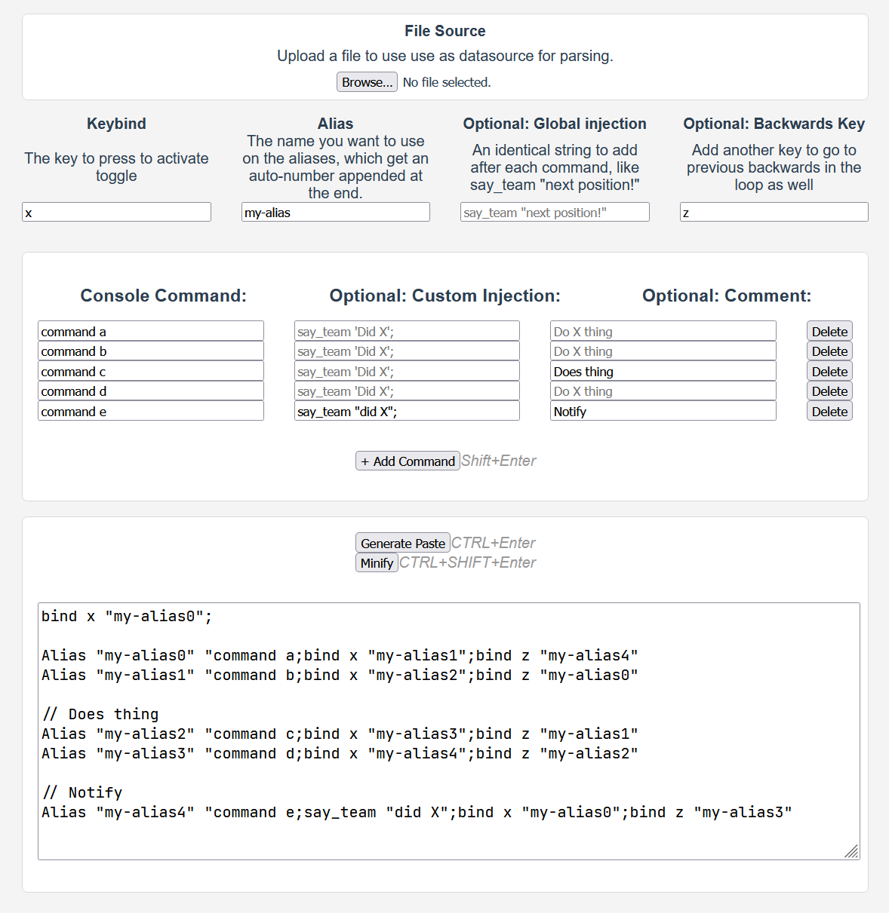

# CS:GO Alias Looping Tool
A simple web-based tool to set up CS:GO console commands that loops, using a single key.  
Used for iterating over commands. Has support for going forwards and backwards.


## Project setup
```
npm install
```

### Compiles and hot-reloads for development
```
npm run serve
```

### Compiles and minifies for production
```
npm run build
```

### Lints and fixes files
```
npm run lint
```

### Customize configuration
See [Configuration Reference](https://cli.vuejs.org/config/).
